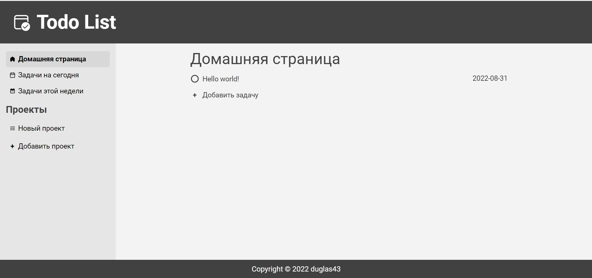

# To-do-List

Hello world от мира JavaScript. To-do List

## Ссылка на сайт

https://duglas43.github.io/To-Do/

## Что узнал

Этот проект дал мне важное понимание того, как нужно работать с браузерным Api, local Storage, обработчиками событий.

## Какие возникали проблемы

Самая интересная проблема, которую я решил заключалась в организации local storage. Как оказалось, метод Json.Stringify не передаёт в local storage объектные методы, а передаёт только поля объектов. Для того, чтобы решить эту проблему я создал отдельные функции и обращался к ним.

## Скриншот

